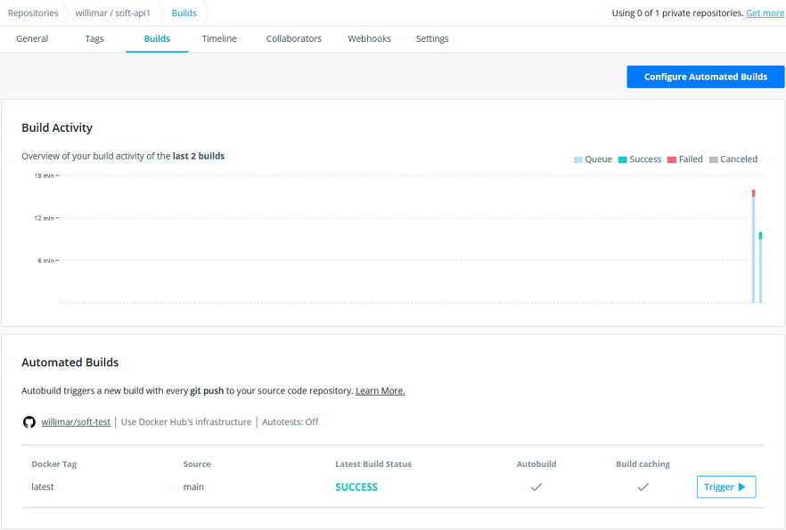
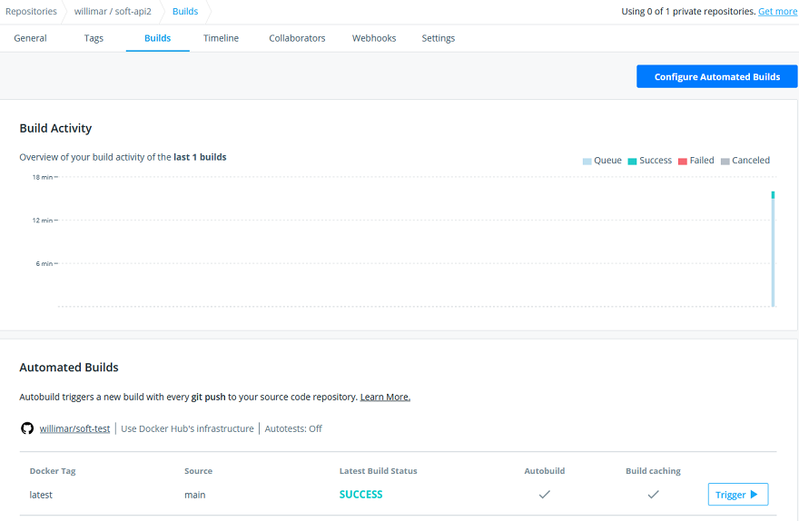

# Calculo de Juros Composto v1.0.1.1

Este projeto se trata de um processo de avaliação não me responsabilizo pelo uso indevido e não irei mantê-lo após o resultado.

O projeto é constituído de duas soluções distintas, que foram colocadas num mesmo repositório somente para facilitar ao avaliador. Numa situação normal cada solução teria seu próprio repositório.

O projeto tem como finalidade simular um ambiente de cálculo de juros, composto de em micro serviços, onde um dos serviços retorna o valor dos juros e o outro executa o cálculo.

## soft-test-api1 – [InterestRate](soft-test-api1/README.md)
API responsável por retornar a taxa de juros, possui somente um controller. Para ler mais sobre a API clique [aqui] (soft-test-api1/README.md)

Localizado na pasta: [soft-test-api1](soft-test-api1).
Solution name `InterestRate.sln`

## soft-test-api2 – [CalculateInterest](soft-test-api2/README.md)
API responsável por executar o cálculo dos juros, possui dois controllers. Para ler mais sobre a API clique [aqui] (soft-test-api2/README.md)

Localizado na pasta: [soft-test-api2](soft-test-api2).
Solution name `CalculateInterest.sln`

#Swagger
Em ambas as APIs, foi utilizado o Swagger. O acessado ao URL root irá redirecionar automáticamente para o ambiente UI em ` /swagger/index.html`.

#Docker
Para ambos os projetos, foi criado um arquivo DockerFile, para executar a criação de uma imagem docker. No readme de cada projeto tem instruções de como executar a criação das imagens assim como instruções de como executar o container.

> **observação** Somente no container da API 2 foi utilizada **variável de ambiente**. Mais sobre a variável e sua finalidade poder ser lida no [readme](soft-test-api2/README.md) do projeto.
> Para executar o push das imagens no docker hub eu habilitei o processo de CD com o buid automático no docker hub. Veja as imagens abaixo a confirmação da entrega das imagens. 
> Ná prática eu não usaria estes nomes para as imagens, mas a finalidade é apresentar o conhecimento.
> Veja aqui as publicações [API 1](https://hub.docker.com/r/willimar/soft-api1) e [API 2](https://hub.docker.com/r/willimar/soft-api2)

