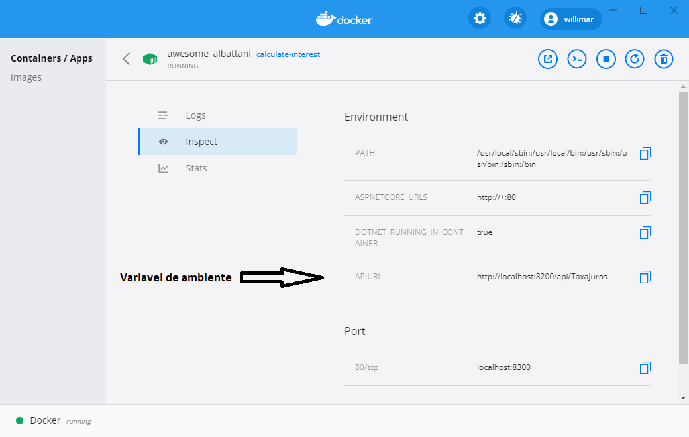

# Calculo de Juros Composto v1.0.1.1

Este projeto se trata de um processo de avaliação não me responsabilizo pelo uso indevido e não irei mantê-lo após o resultado.

O projeto é constituído de duas soluções distintas, que foram colocadas num mesmo repositório somente para facilitar ao avaliador. Numa situação normal cada solução teria seu próprio repositório.

O projeto tem como finalidade simular um ambiente de cálculo de juros composto baseado em micro serviços, onde um dos serviços retorna o valor dos juros e o outro executa o cálculo.

## API 1 – [InterestRate](soft-test-api1/README.md)
API responsável por retornar a taxa de juros, possui somente um controller. Para ler mais sobre a API clique [aqui] (soft-test-api1/README.md)

## API 2 – [CalculateInterest](soft-test-api2/README.md)
API responsável por executar o cálculo dos juros, possui dois controllers. Para ler mais sobre a API clique [aqui] (soft-test-api2/README.md)

#Swagger
Em ambas as API foi utilizado o Swagger e se acessado o URL root haverá o redirecionamento automático para o UI em ` /swagger/index.html`.

#Docker
Em ambos os projetos foi criado um arquivo DockerFile para executar a criação de uma imagem. No readme de cada projeto tem instruções de como executar a criação das imagens assim como instruções de como executar o container.
> **observação** Somente no container da API 2 foi utilizada **variável de ambiente**. Mais sobre a variável e sua finalidade poder ser lida no [readme](soft-test-api2/README.md) do projeto.

